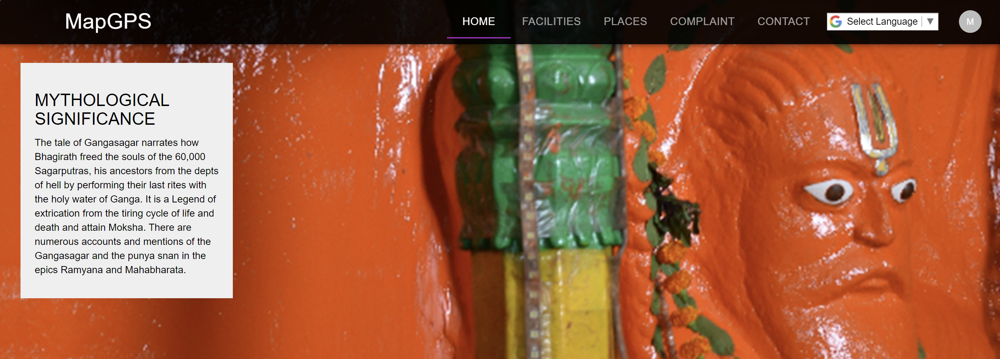
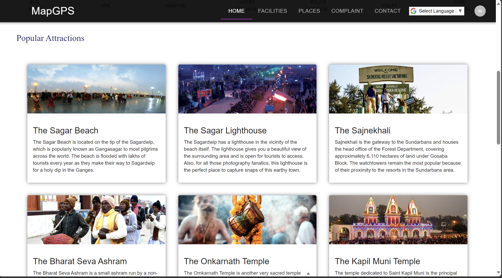
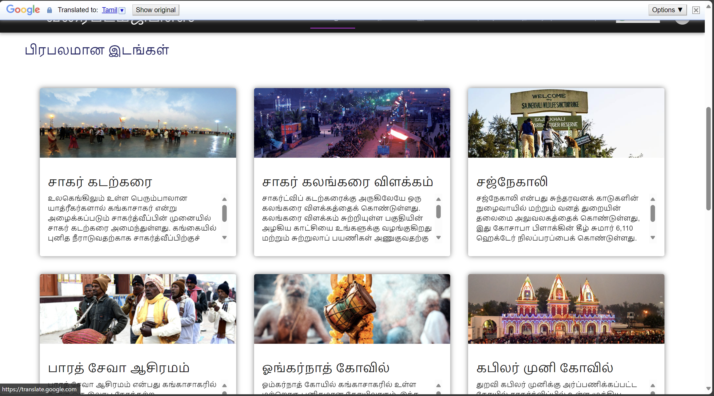
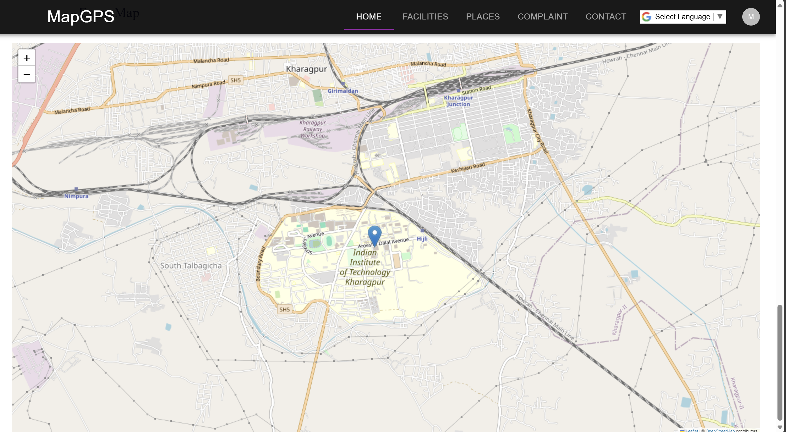
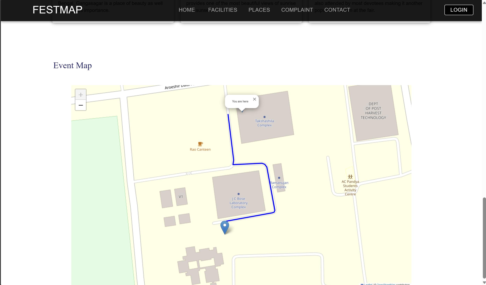
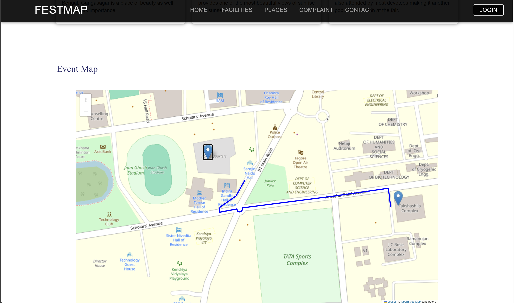

# 🗺️ Crowd Managment Event Map

> Crowd Management Event Map is a web application that provides users with information about various facilities, important places, and maps for navigation purposes.

## 🚀 Introduction

Crowd Management Event Map is designed to help users navigate through different locations, find important places, and discover nearby facilities. Whether you're exploring a new city or planning a trip, Crowd Management Event Map provides you with the tools you need to find your way around.

## ✨ Features

- **Facilities Overview:** View a list of facilities such as bus stops, hospitals, police stations, and more.
- **Important Places:** Discover important landmarks and attractions in the area.
- **Interactive Maps:** Explore maps with markers indicating various points of interest.
- **Route Planning:** Plan routes and get directions to your desired destinations.
- **Google Translate Integration:** Seamlessly translate content to different languages for better accessibility.

## 🛠️ Technologies Used

- React
- React Router
- Material-UI
- Leaflet
- Bootstrap
- Vite
- Appwrite (for backend services)
- Google Translate API

## 📸 Demo Pictures

#### Image Slideshow



#### Popular Attractions



#### Google Translate API



#### Facilities


#### Event Map



#### User Location



#### Routing Service



## 🏁 Getting Started

To get started with gangasagar-mela-event-map, follow these steps:

1. Clone the repository: `git clone <repository-url>`
2. Install dependencies: `npm install`
3. Run the development server: `npm run dev`
4. Open your browser and navigate to `http://localhost:8000` to view the application.

### Setting Up Database Connection and API Key

To connect to your database and use the API key in your project, you need to follow these steps:

#### Map.jsx

Replace `""` with your Open Route Service API key in the `const apiKey = "";` declaration:

```javascript
const apiKey = "YOUR_API_KEY";
```

Replace the empty strings `""` in the `listDocuments("", "")` method with your App Write document ID and collection ID:

```javascript
database.listDocuments("YOUR_DOCUMENT_ID", "YOUR_COLLECTION_ID");
```

#### AppWriteConfig.jsx

Add your App Write database ID by replacing `""` in the `new Databases(client, "")` method:

```javascript
new Databases(client, "YOUR_DATABASE_ID");
```

Add your App Write project ID by replacing `""` in the `setProject()` method:

```javascript
client.setProject("YOUR_PROJECT_ID");
```

Make sure to fill in the required values accurately to establish a successful connection with your database and utilize the API key in your project.

## 🔧 Usage

Once the application is running, you can:

- Explore different facilities by clicking on the corresponding icons.
- Discover important places and landmarks in the area.
- Use the interactive map to navigate through different locations.
- Plan routes and get directions to your desired destinations.

## 🤝 Contributing

Contributions to Crowd Management Event Map are welcome! To contribute:

1. Fork the repository
2. Create your feature branch: `git checkout -b feature-name`
3. Commit your changes: `git commit -am 'Add some feature'`
4. Push to the branch: `git push origin feature-name`
5. Submit a pull request

## 📄 License

This project is licensed under the [MIT License](LICENSE).

---
